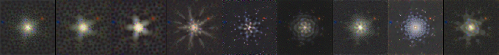
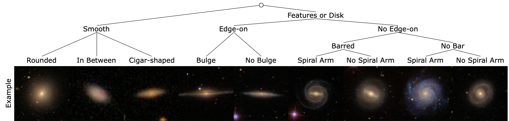

# Dataset Distillation by Self-Adaptive Trajectory Matching



This repository contains code for Self-Adaptive Trajectory Matching (STM) algorithm, an improved version of Matching Training Trajectory (MTT). It also includes code for processing Galaxy Zoo 2 dataset for paper: Galaxy Dataset Distillation.

## Getting Started

Clone the repository and create a python environment with pytorch, at least one cuda supported GPU is required.

## Generating Expert Trajectories

Before doing any distillation, you'll need to generate some expert trajectories using `buffer.py`. The following command will train 10 ConvNet models on CIFAR-10 with ZCA whitening for 50 epochs each:

```bash
python buffer.py --dataset=CIFAR10 --model=ConvNet --train_epochs=50 --num_experts=10 --zca --buffer_path={path_to_buffer_storage} --data_path={path_to_dataset}
```

Note that experts need only be trained once and can be re-used for multiple distillation experiments. The example trains only 10 experts for fast demo purpose, `--num_experts=10`. To get our reported results, we train 100 experts for each dataset.

## Available Datasets

* CIFAR10
* CIFAR100
* ImageNet
* GZoo2 (See Detail Below)
* GZoo_aug (See Detail Below)

### GZoo2

[Galaxy Zoo 2 (GZ2)](https://academic.oup.com/mnras/article/435/4/2835/1022913) is a survey based dataset. For better performance, we simplify the classification tree and build a curated version Based on [GZ2 Table 5](https://data.galaxyzoo.org), which contains 243500 images. The simplified classification tree is shown below.



We sort the confidence of galaxies in descending order and pick the top 600 confident images for each class to form a curated dataset. The curated dataset is divided into 500 training and 100 testing images per class, result of total 4500 training image and 900 testing images. The curated dataset is named as GZoo2.

[Download our dataset](https://drive.google.com/drive/folders/1Ax4hj-EwnASp2qOyH5Io5WQS5lL0lNJG?usp=sharing) and save it in `{path_to_dataset}`.

### GZoo2_aug

GZoo2_aug is a dataset generated by applying rotational augmentation on GZoo2. Every training image in GZoo2 is rotated for 36 degree 10 times. GZoo2_aug contains 45000 training images and 900 testing images.

[Download our dataset](https://drive.google.com/drive/folders/1Ax4hj-EwnASp2qOyH5Io5WQS5lL0lNJG?usp=sharing) and save it in `{path_to_dataset}`.

## Distill Knowledge from Expert Trajectories

The following command will then use the buffers we generate before to distill CIFAR-10 a 1 image per class synthetic dataset:

```bash
python distill.py --dataset=CIFAR10 --ipc=1 --syn_steps=50 --zca --lr_img=1000 --lr_teacher=0.01 --lr_lr=0.01 --buffer_path={path_to_buffer_storage} --data_path={path_to_dataset}
```

### Distillation Hyperparameter

| Dataset   | Img/Cls | Synthetic Steps <br />$(N)$ | Learning Rate <br />(Pixels) | Initial Step Size <br />$(\alpha)$ | Learning Rate <br />(Step Size) |
| --------- | ------- | --------------------------- | ---------------------------- | ---------------------------------- | ------------------------------- |
|           | 1       | 50                          | 1000                         | 0.01                               | 0.01                            |
| CIFAR-10  | 10      | 30                          | 1000                         | 0.01                               | 0.01                            |
|           | 50      | 30                          | 1000                         | 0.01                               | 0.01                            |
|           | 1       | 20                          | 1000                         | 0.01                               | 0.01                            |
| CIFAR-100 | 10      | 20                          | 1000                         | 0.01                               | 0.01                            |
|           | 50      | -                           | -                            | -                                  | -                               |
|           | 1       | 50                          | 10000                        | 0.0001                             | 0.01                            |
| GZoo2     | 10      | 20                          | 10000                        | 0.0001                             | 0.01                            |
|           | 50      | -                           | -                            | -                                  | -                               |

### Distillation Parameters

| Argument          | Description                                                |
| ----------------- | ---------------------------------------------------------- |
| `--dataset`       | Dataset Name: `str`                                        |
| `--ipc`           | Distillation Image Per Class: `int`                        |
| `--syn_steps`     | Synthetic Step: `int`                                      |
| `--lr_teacher`    | Initial student network learning rate (step size): `float` |
| `--lr_lr`         | Learning rate for updating step size: `float`              |
| `--lr_img`        | Learning rate for updating synthetic image: `int`          |
| `--pix_init=real` | Synthetic image initialization. Choose from: {noise/real}  |

#### Optional Parameters

| Argument                        | Description                                                                                       |
| ------------------------------- | ------------------------------------------------------------------------------------------------- |
| `--wandb_name=Job_1`            | Customize your wandb job name: `str`                                                              |
| `--max_duration=1000`           | Maximum duration for one stage of Hypothesis testing $(T_{max})$: `int`                           |
| `--sigma=5`                     | The number of sigma $(\lambda\sigma)$ as the critical value of Hypothesis testing: `float`        |
| `--buffer_path={path}`          | Buffer path: `str`                                                                                |
| `--data_path={path_to_dataset}` | Dataset Path: `str`                                                                               |
| `--eval_it=100`                 | Evaluation interval, smaller value evaluate more frequently: `int`                                |
| `--sigma=5`                     | The number of sigma as the critical value of Hypothesis testing: `float`                          |
| `--init_epoch=1`                | Initial trajectory matching epoch pool size, (Default is 1): `[0, init_epoch)`                    |
| `--expert_epochs=1`             | MTT parameter. We fix it to 1 for STM: `int`                                                      |
| `--max_start_epoch=29`          | Maximum epoch for stage distillation: `int`. Use the `train_epochs` value during expert training. |
| `--Iteration=10000`             | Maximum global iteration, in case distillation run too long: `int`                                |
| `--lr_lr`                       | Learning rate for updating step size: `float`                                                     |
| `--lr_img`                      | Learning rate for updating synthetic image: `int`                                                 |

## WanDB Guide

Stagewise-MTT algorithm generates an independent `loss` and `test_loss` for each individual starting epoch. When the values log into WanDB server, each value will be plotted in an individual plot. In this guide, we will show you how to plot them in a same plot for better visualization. For example:


* Delete all individual plot in the format of `Grand_Loss_epoch_` and `Next_Epoch_Loss_`. (The data is still saved in the backend of WanDB)
* Click edit panel, search `Grand_Loss_epoch_` or `Next_Epoch_Loss_` in y attribute, and manually add all same type data into the same plot.
