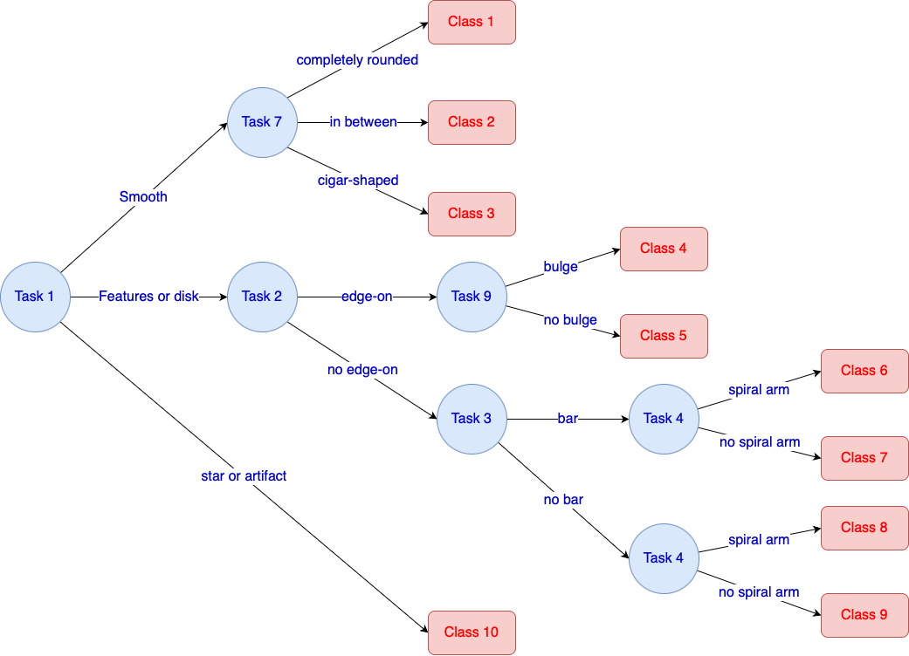
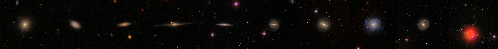
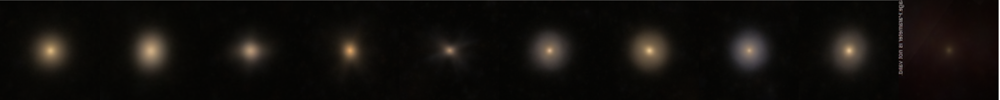
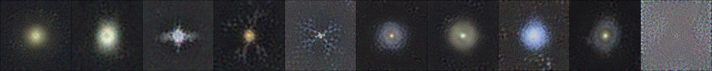

# Galaxy Dataset Distillation

Galaxy dataset distillation is a project on creating synthesized image representations of galaxy properties. It is an extension of the general dataset distillation method, which aims to distill a large dataset into a smaller one that can be used to train a model and possibly approximates the accuracy of a model trained on the full dataset. We apply the state-of-the-art [trajectory matching algorithm](https://georgecazenavette.github.io/mtt-distillation/) to Galaxy Zoo 2 dataset. Below are some awesome examples of our distillation result. We are currently drafting the paper for conference workshop.

## About Galaxy Zoo 2 Dataset

[Galaxy Zoo 2](https://academic.oup.com/mnras/article/435/4/2835/1022913) is a survey based dataset. Based on original classification tree, we build a simplified version for this project.

Where the demonstration of each class is as following:

### Sub Dataset 100 Per Class

We sort the confidence of galaxies in descending order and pick the top 100 confident images for each class to form a sub dataset (a dataset of 1000 images).

#### Baseline Image and ACC

To study this sub dataset, we averaged the 100 images of each class and form the picture below. Training a ConvNetD3 using the **one per class AVG images**, the ACC is $19.39$%. This serves as the **baseline** of our approach.

#### Distillation and ACC

Below is our current best distilled **one per class synthetic images**. The ACC is as high as $46$%. (Full Dataset is $65$%).

