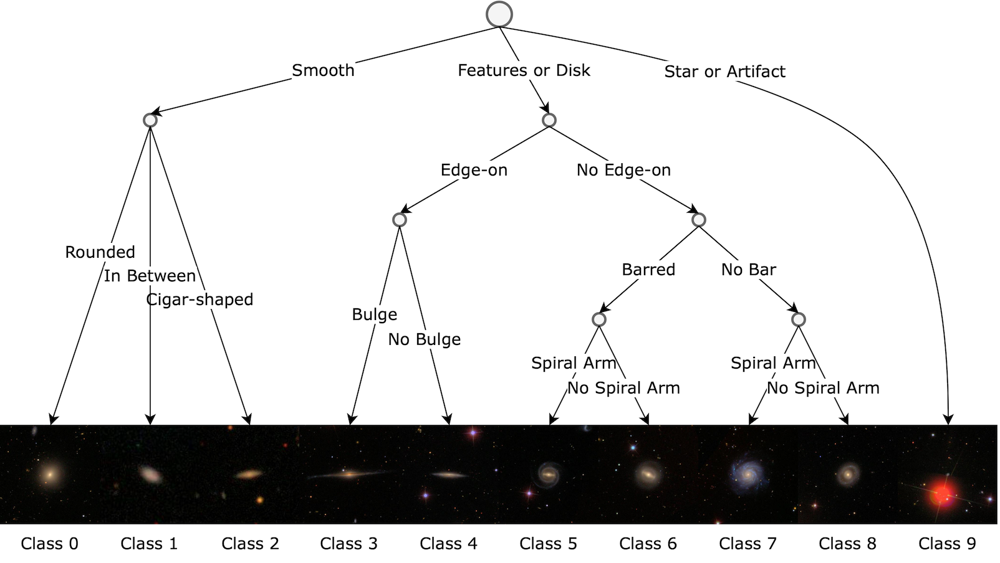
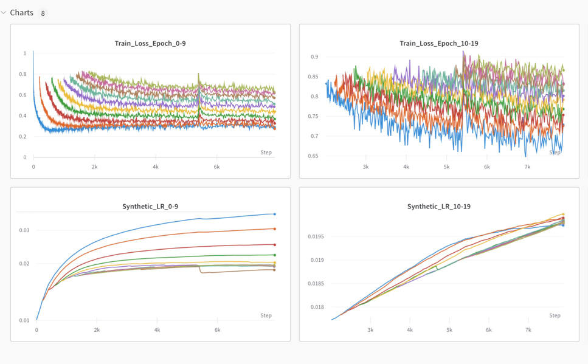

# Galaxy Dataset Distillation

Galaxy dataset distillation is a project on creating synthesized image representations of galaxy properties. It is an extension of the general dataset distillation method, which aims to distill a large dataset into a smaller one that can be used to train a model and possibly approximates the accuracy of a model trained on the full dataset. We apply the state-of-the-art [trajectory matching algorithm](https://georgecazenavette.github.io/mtt-distillation/) to Galaxy Zoo 2 dataset. Below are some awesome examples of our distillation result. We are currently drafting the paper for a conference workshop.

## About Galaxy Zoo 2 Dataset

[Galaxy Zoo 2](https://academic.oup.com/mnras/article/435/4/2835/1022913) is a survey based dataset. Based on original classification tree, we build a simplified version for this project.

### Sub Dataset 100 Per Class

We sort the confidence of galaxies in descending order and pick the top 100 confident images for each class to form a sub dataset (a dataset of 1000 images).

#### Baseline Image and ACC

To study this sub dataset, we averaged the 100 images of each class and form the picture below. Training a ConvNetD3 using the **one per class AVG images**, the ACC is $19.39$%. This serves as the **baseline** of our approach.

#### Distillation and ACC

Below is our current best distilled **one per class synthetic images**. The ACC is as high as $46$%. (Full Dataset is $65$%).

### Distillation Hyperparameter

| Argument Example                    | Description                                                                                                 |
| ----------------------------------- | ----------------------------------------------------------------------------------------------------------- |
| `--init_epoch=1`                    | Stage Distillation starting epoch range, (recommending value: 1): `[0, init_epoch)`                         |
| `--lr_teacher 0.001 --init_epoch=1` | `Synthetic lr`, its length should match the value of `init_epoch`, split the values by space: `list[float]` |
| `--dataset=CIFAR10`                 | Dataset Name: `str`                                                                                         |
| `--ipc=1`                           | Distillation Image Per Class: `int`                                                                         |
| `--syn_steps=15`                    | Synthetic Step: `int`, usually the larger, the better, uses more GPU memory and slower.                     |
| `--expert_epochs=1`                 | Refer to MTT-Distillation. For this algorithm, Fix it to 1                                                  |
| `--max_start_epoch=29`              | Maximum epoch for stage distillation: `int`. Use the number of epoch in buffer minus 1.                     |
| `--lr_img=1000`                     | Learning rate for updating synthetic image: `int`                                                           |
| `--lr_lr=0.01`                      | Learning rate for updating lr_teacher: `float`                                                              |
| `--pix_init=noise`                  | Synthetic image initialization. Choose from: {noise/real}                                                   |
| `--buffer_path={path}`              | Buffer path: `str`                                                                                          |
| `--data_path={path_to_dataset}`     | Dataset Path: `str`                                                                                         |
| `--Iteration=10000`                 | Maximum number of iteration: `int`                                                                          |
| `--eval_it=200`                     | Evaluation interval: `int`                                                                                  |
| `--prev_iter=0`                     | (Optional: `default: 0`) Count the iteration from this given value.                                         |
| `--wandb_name=Job_1`                | (Optional: `str`) Customize your wandb job name                                                             |
| `--load_syn_image={path}`           | (Optional: `str`) Load pretrained synthetic image, format is `wandb_name/images_#.pt`                       |

## WanDB Guide

Stagewise-MTT algorithm generates an independent `loss` and `synthetic lr` for each individual epoch. When the values log into WanDB server, each value will be plotted in an individual plot. In this guide, we will show you how to plot them in a same plot for better visualization. For example:

In general, you could follow the [official Line Plot documentation](https://docs.wandb.ai/guides/app/features/panels/line-plot) to do configuration.

Here, we will give instruction to generate the exact example showing above.

* Delete all individual plot in the format of `Grand_Loss_epoch_` and `Synthetic_LR_`. (The data is still saved in the backend of WanDB)
* Manually add some number of new panels (based on how many epochs you used). **Note that each line plot can hold at most 10 lines**. Edit each panel, select the regular expression tab in `y`, and type something like `^Grand_Loss_epoch_[0-9]$`.
