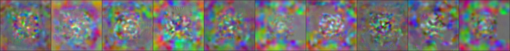
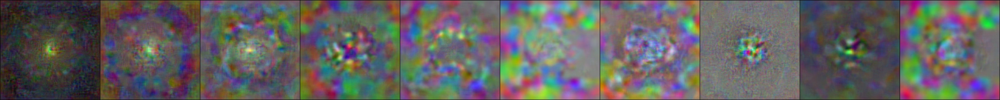
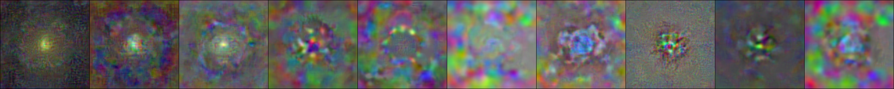

# Haowen Guan's Experiment log

## Configuration of distilling 1 image per class, Dataset: 0.5 threshold 10 class

**First**: repeatedly fitting synthetic data **only on starting epoch #0 (and forward 2 epoch)** of expert trajectory. [Link](https://wandb.ai/galaxy-datadistill/DatasetDistillation/runs/fv29r1d6?workspace=user-haowenguan)

Distilled from: (test ACC: **0.1**)



to:  (test ACC: **0.2797**)



```text
--dataset=dl-DR17-05
--ipc=10
--syn_steps=1
--expert_epochs=2 !!!!!!!!!!!!!!!!!!!!!!!!!!!!!!!!!!!!!!!!!!!!!!!!!!!!
--max_start_epoch=48
--lr_img=1000
--lr_lr=1e-05
--lr_teacher=0.002
--pix_init=noise
--buffer_path={path_to_buffer_storage}
--data_path={path_to_dataset}
```

**Second**: starting to fit synthetic data **starting from epoch #1 (and forward 2 epoch)** of expert trajectory. [Link](https://wandb.ai/galaxy-datadistill/DatasetDistillation/runs/eskxmok5?workspace=user-haowenguan)

Distilled from prev to this: (test ACC: **0.3045**)



```text
--dataset=dl-DR17-05
--ipc=10
--syn_steps=1
--expert_epochs=2 !!!!!!!!!!!!!!!!!!!!!!!!!!!!!!!!!!!!!!!!!!!!!!!!!!!!
--max_start_epoch=48
--lr_img=1000
--lr_lr=1e-05
--lr_teacher=0.002
--pix_init=noise
--buffer_path={path_to_buffer_storage}
--data_path={path_to_dataset}
```

**Furthermore**, did a lot of experiment on changing to `expert_epochs=1`, and increment starting epoch whenever ACC stop increase for a while. [Link](https://wandb.ai/galaxy-datadistill/DatasetDistillation/runs/2oui09zh?workspace=user-haowenguan)


## Configuration of distilling 10 image per class, Dataset: 0.5 threshold 10 class

**First**: repeatedly fitting synthetic data **only on starting epoch #0 (and forward 1 epoch)** of expert trajectory. [Link](https://wandb.ai/galaxy-datadistill/DatasetDistillation/runs/1cyybreq?workspace=user-haowenguan)

Distilled from **noise** (test ACC: **0.06**) to following: (test ACC: **0.3074**), **[EACH ROW IS A CLASS]**.


```text
--dataset=dl-DR17-05
--ipc=10
--syn_steps=1
--expert_epochs=1
--max_start_epoch=48
--lr_img=1000
--lr_lr=1e-05
--lr_teacher=0.002
--pix_init=noise
--buffer_path={path_to_buffer_storage}
--data_path={path_to_dataset}
--epoch_eval_train=100
--eval_it=500
--Iteration=40000
```

**Second-step-Version-1**: starting to fit synthetic data **starting from epoch #0 (and forward 2, 3, 4, ... epochs)** of expert trajectory. Code is same as above. [Link](https://wandb.ai/galaxy-datadistill/DatasetDistillation/runs/3buvcz6o?workspace=user-haowenguan)

*Bad result, not working.*


**Second-step-Version-2**: starting to fit synthetic data **starting from epochs #2, 3, 4, ... and forward 1 epochs** of expert trajectory. Code is same as above. Link


